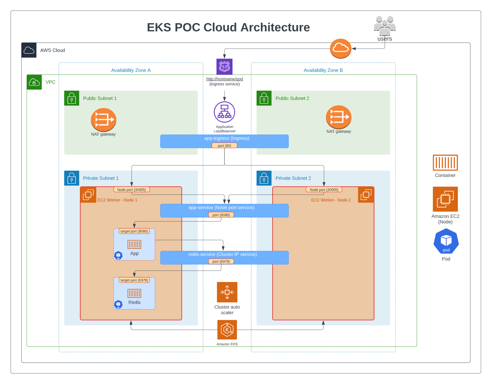

# Terraform EKS POC

Use the code in the repo as a guide in provisioning an Kubernetes(k8s) cluster on AWS Elastic Kubernetes Service (EKS) with Terraform. It also includes a sample containerized python application (quote of the day) and manifest files for deployment on the created EKS cluster. This will be used as a guide in setting up DLFrame services in AWS EKS

## Cloud Architecture (AWS)

## Local Deployment
### Requirements/ dependencies for local deployment
1. Docker
2. Docker compose

### Steps
1. Run application with docker compose (build image and run containers) - `docker-compose -f ./app/docker-compose.yml up -d`
2. Open application `http://localhost:8080/qod`
3. Kill application (stop containers and delete images from local repo) - `docker-compose -f ./app/docker-compose.yml down`

## Cloud Deployment - EKS

### Requirements/ dependencies for cloud deployment
1. AWS CLI
2. Terraform
3. Kubectl
4. Docker
5. jquery

### Features of EKS cluster
The add-ons to the eks cluster were installed using the Terraform helm provider
1. AWS load balancer controller
2. Cluster autoscaler
3. Horizontal Pod scaler and metrics server
4. Prometheus and Grafana monitoring

### Setup
#### Kubernetes (k8s)
1. Enter ingress annotations for DNS hostname and certificate arn if applicable in `./app/ci/k8s/ingress.yml`
2. Update image repo for container in `./app/ci/k8s/app-manifest.yml`

#### Create s3 bucket for Terraform backend - (run commands from terraform folder)
1. From root folder, change directory into terraform folder - `cd ./terraform`
2. Create s3 bucket for backend - `./config/create_backend.sh <region>`

#### Update backend.tf file
1. Ensure key is in this format - use `"<env>/terraform-state"` as value for s3 key
2. Update the region

### Update the backend.conf file
1. Use an appropriate bucket name - `<application_name>-eks-terraformstate`
2. Follow similar pattern for dynamodb table - `<application_name>-eks-terraformstate-lock`

#### Terraform environment variables
1. Enter environment values for cluster in tfvar files found in `./terraform/env`
2. Ensure the proper arn's are entered for the admin and read access roles. Note that existing arn has to be modified. The roles can be found by performing a role search in IAM (in deploy environment) for 'SSO'. The values in this repo are from the cloudpoint dev environment.  

### Terraform - build infrastructure

#### Build EKS cluster, Networking and ECR 
1. `cd terraform/`
2. `terraform init -backend-config="./config/backend.conf"`
3. `terraform plan -var-file=env/<env>.tfvars`
4. `terraform apply -var-file=env/<env>.tfvars --auto-approve`

### Docker - build image - (run commands from terraform folder)
1. `docker build -t app ../app/`

### ECR - push image to ECR - (run commands from terraform folder using AWS CLI)
 * jquery (jq) is required to run the commands in step 2-3 below
1. login to ECR - `aws ecr get-login-password --region $(terraform output -raw region) | docker login --username AWS --password-stdin $(terraform output -raw aws_account_id).dkr.ecr.$(terraform output -raw region).amazonaws.com`
2. Tag image for ECR - `docker tag app:latest $(terraform output -json repository_url_map | jq -r '.app'):latest`
3. Push image to ECR - `docker push $(terraform output -json repository_url_map | jq -r '.app'):latest`

### Deploy app to EKS cluster - (run commands from terraform folder using AWS CLI)
1. Change kubeconfig context to eks cluster - `aws eks --region $(terraform output -raw region) update-kubeconfig --name $(terraform output -raw cluster_name)`
2. Create namespace for running service resources - `kubectl create namespace dlframe`
3. create kubernetes resources - `kubectl apply -f ../app/ci/k8s/ -n dlframe`

#### View deployed resources using Kubectl
1. kubectl get all resources in default namespace - `kubectl get all -n dlframe -o wide`
2. watch events - `kubectl get events -n dlframe --watch`
3. get log for pod - `kubectl logs <pod_name> -n dlframe`
4. view ingress (app hostname and load balancer) - `kubectl get ingress -n dlframe -o wide`
5. view cluster roles - `kubectl get clusterroles`
6. View cluster roles mapped to iam role - `kubectl edit configmap/aws-auth -n kube-system`

#### View deployed resources using Lens
1. Download lens - https://k8slens.dev/
2. Lens will automatically load cluster info from kube config file (`~/.kube/config`) if context was set. See Deploy app to EKS cluster - step 1.
3. Click on cluster in lens to connect to it.

### Deploy app with Helm chart
1. Create chart - `cd` into folder you want chat on and enter - 
`Test template to ensure its working - helm template app_chart --values ./app_chart/values-dev.yaml`
2. `Install - helm install app-chart ../app/ci/app_chart/ --values ../app/ci/app_chart/values-dev.yaml`
3. `Dry run - helm install app-chart ../app/ci/app_chart/ --values ../app/ci/app_chart/values-dev.yaml --dry-run`
4. `view installed charts - helm list`

### Open app 
1. Open the hostname entered in the app's ingress manifest or load balancer address if no hostname is specified in the ingress manifest `<hostname>/qod` or `<load balancer dns address>/qod`

## References
1. [Provision an EKS Cluster learn guide](https://learn.hashicorp.com/terraform/kubernetes/provision-eks-cluster)

